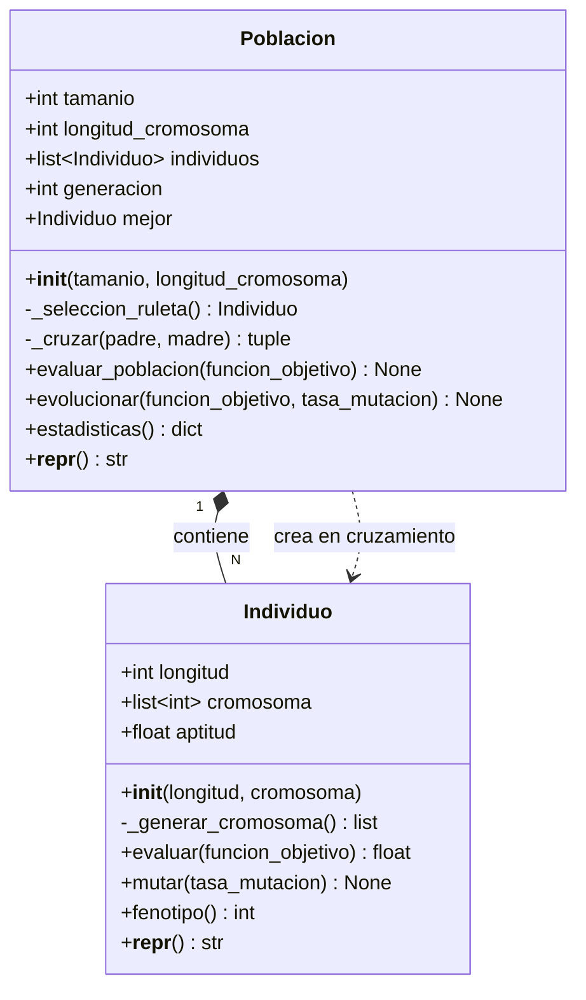

# Cómputo Evolutivo — Reporte de Lectura y Clases Base

> **Referencia:** Kuri, Á. (2002). *Algoritmos genéticos*. México D.F.: Instituto Politécnico Nacional.  
> Temas leídos: 1.1 La naturaleza como optimizadora · 1.2 Un poco de biología

---

## Reporte de Lectura

### 1.1 La naturaleza como optimizadora

La naturaleza lleva millones de años resolviendo problemas extremadamente complejos sin ningún diseñador explícito. La evolución biológica es, en esencia, un proceso de búsqueda y optimización: ante un entorno cambiante, los organismos que mejor se adaptan sobreviven y se reproducen, transmitiendo sus características a la siguiente generación. Con el tiempo, la población en su conjunto se "mueve" hacia soluciones cada vez mejores.

Kuri destaca que este proceso tiene tres propiedades que lo hacen atractivo para la computación:

- **Es paralelo:** muchos individuos exploran el espacio de soluciones al mismo tiempo.
- **Es robusto:** no se queda atrapado fácilmente en mínimos locales porque mantiene diversidad en la población.
- **Es general:** no necesita conocer la estructura matemática del problema; solo requiere poder evaluar qué tan buena es una solución.

Estas propiedades inspiraron el desarrollo de los **Algoritmos Genéticos (AG)**, que imitan el proceso evolutivo para encontrar soluciones óptimas o cercanas al óptimo en problemas donde los métodos clásicos fallan o son demasiado costosos.

La idea central es simple: si la naturaleza puede "diseñar" ojos, alas o sistemas inmunes mediante selección y herencia, un algoritmo que replique ese mecanismo debería ser capaz de encontrar buenas soluciones a problemas de ingeniería, diseño o búsqueda.

---

### 1.2 Un poco de biología

Para entender los AG es necesario comprender los conceptos biológicos que los fundamentan. Kuri los resume de la siguiente manera:

**Genotipo y fenotipo**  
Cada organismo posee un **genotipo**: la información genética codificada en sus cromosomas (cadenas de ADN compuestas por genes). El **fenotipo** es la expresión observable de ese genotipo, es decir, las características físicas y funcionales del organismo. En los AG, el genotipo es el cromosoma codificado (generalmente en binario) y el fenotipo es la solución que ese cromosoma representa.

**Cromosoma y genes**  
Un cromosoma es una estructura que contiene unidades de información llamadas **genes**. Cada gen ocupa una posición fija en el cromosoma (locus) y puede tomar distintos valores (alelos). La combinación de todos los genes define al individuo.

**Selección natural**  
La presión del entorno actúa como filtro: los individuos con mayor **aptitud** (*fitness*) — es decir, los que mejor resuelven el problema de supervivencia — tienen mayor probabilidad de reproducirse. Este principio darwiniano se traduce en los AG como una función objetivo que asigna un valor numérico a cada solución.

**Reproducción y cruzamiento**  
Cuando dos individuos se reproducen, sus cromosomas se combinan mediante el **cruzamiento** (*crossover*): se toma una parte del cromosoma de cada progenitor para formar un nuevo individuo. Esto permite heredar características útiles de ambos padres.

**Mutación**  
Ocasionalmente ocurren errores en la copia del ADN que modifican uno o más genes de forma aleatoria. La **mutación** introduce variedad genética y evita que la población converja prematuramente hacia una solución subóptima. En los AG se aplica con una tasa baja para no destruir soluciones ya buenas.

**Generaciones**  
El ciclo evolutivo completo — evaluación, selección, cruzamiento y mutación — constituye una **generación**. A lo largo de múltiples generaciones, la aptitud promedio de la población tiende a aumentar.

---

## Diagrama UML de las Clases



---

## Código de las Clases

### `Individuo`

```python
import random

class Individuo:
    """
    Modela un organismo dentro de una población evolutiva.

    Atributos
    ---------
    cromosoma : list[int]
        Secuencia de genes (bits 0/1) que representan el genotipo.
    longitud  : int
        Número de genes en el cromosoma.
    aptitud   : float
        Valor de fitness asignado por la función objetivo.
    """

    def __init__(self, longitud: int, cromosoma: list = None):
        self.longitud  = longitud
        self.cromosoma = cromosoma if cromosoma else self._generar_cromosoma()
        self.aptitud   = 0.0

    def _generar_cromosoma(self) -> list:
        """Genera un genotipo binario aleatorio (diversidad inicial)."""
        return [random.randint(0, 1) for _ in range(self.longitud)]

    def evaluar(self, funcion_objetivo) -> float:
        """
        Calcula la aptitud del individuo aplicando la función objetivo.
        Simula la 'prueba' que el entorno le impone al organismo.
        """
        self.aptitud = funcion_objetivo(self.cromosoma)
        return self.aptitud

    def mutar(self, tasa_mutacion: float = 0.01) -> None:
        """
        Aplica mutación gen a gen con la tasa dada.
        Introduce variaciones aleatorias (análogo a errores de copia en el ADN).
        """
        for i in range(self.longitud):
            if random.random() < tasa_mutacion:
                self.cromosoma[i] ^= 1  # flip del bit
        self.aptitud = 0.0

    def fenotipo(self) -> int:
        """Convierte el genotipo binario a su valor decimal (expresión del fenotipo)."""
        return int("".join(str(g) for g in self.cromosoma), 2)

    def __repr__(self) -> str:
        genes = "".join(str(g) for g in self.cromosoma)
        return f"Individuo(genotipo={genes}, fenotipo={self.fenotipo()}, aptitud={self.aptitud:.4f})"
```

---

### `Poblacion`

```python
class Poblacion:
    """
    Modela un conjunto de individuos sometidos a la presión evolutiva.

    Atributos
    ---------
    tamanio            : int   — Número de individuos.
    longitud_cromosoma : int   — Longitud del cromosoma de cada individuo.
    individuos         : list  — Colección actual de organismos.
    generacion         : int   — Contador del ciclo evolutivo actual.
    mejor              : Individuo | None — Individuo de mayor aptitud histórica.
    """

    def __init__(self, tamanio: int, longitud_cromosoma: int):
        self.tamanio             = tamanio
        self.longitud_cromosoma  = longitud_cromosoma
        self.generacion          = 0
        self.mejor               = None
        self.individuos = [Individuo(longitud_cromosoma) for _ in range(tamanio)]

    def _seleccion_ruleta(self) -> Individuo:
        """Selección proporcional al fitness (selección natural)."""
        aptitud_total = sum(ind.aptitud for ind in self.individuos)
        if aptitud_total == 0:
            return random.choice(self.individuos)
        punto = random.uniform(0, aptitud_total)
        acumulado = 0.0
        for ind in self.individuos:
            acumulado += ind.aptitud
            if acumulado >= punto:
                return ind
        return self.individuos[-1]

    def _cruzar(self, padre: Individuo, madre: Individuo) -> tuple:
        """Cruzamiento de un punto: combina cromosomas de dos progenitores."""
        punto = random.randint(1, self.longitud_cromosoma - 1)
        crom_hijo1 = padre.cromosoma[:punto] + madre.cromosoma[punto:]
        crom_hijo2 = madre.cromosoma[:punto] + padre.cromosoma[punto:]
        return (Individuo(self.longitud_cromosoma, crom_hijo1),
                Individuo(self.longitud_cromosoma, crom_hijo2))

    def evaluar_poblacion(self, funcion_objetivo) -> None:
        """Evalúa la aptitud de todos los individuos y actualiza el mejor."""
        for ind in self.individuos:
            ind.evaluar(funcion_objetivo)
        candidato = max(self.individuos, key=lambda i: i.aptitud)
        if self.mejor is None or candidato.aptitud > self.mejor.aptitud:
            self.mejor = Individuo(self.longitud_cromosoma, list(candidato.cromosoma))
            self.mejor.aptitud = candidato.aptitud

    def evolucionar(self, funcion_objetivo, tasa_mutacion: float = 0.01) -> None:
        """Ciclo completo: evaluación → selección → cruzamiento → mutación."""
        self.evaluar_poblacion(funcion_objetivo)
        nueva_generacion = []
        while len(nueva_generacion) < self.tamanio:
            padre = self._seleccion_ruleta()
            madre = self._seleccion_ruleta()
            hijo1, hijo2 = self._cruzar(padre, madre)
            hijo1.mutar(tasa_mutacion)
            hijo2.mutar(tasa_mutacion)
            nueva_generacion.extend([hijo1, hijo2])
        self.individuos = nueva_generacion[:self.tamanio]
        self.generacion += 1

    def estadisticas(self) -> dict:
        """Resumen estadístico de la generación actual."""
        aptitudes = [ind.aptitud for ind in self.individuos]
        return {
            "generacion"  : self.generacion,
            "aptitud_max" : max(aptitudes),
            "aptitud_min" : min(aptitudes),
            "aptitud_prom": sum(aptitudes) / len(aptitudes),
        }

    def __repr__(self) -> str:
        return (f"Poblacion(tamanio={self.tamanio}, "
                f"generacion={self.generacion}, "
                f"mejor_aptitud={self.mejor.aptitud if self.mejor else 'N/A'})")
```

---

## Demo — Problema OneMax

```python
def onemax(cromosoma):
    return float(sum(cromosoma))

poblacion = Poblacion(tamanio=20, longitud_cromosoma=10)

for _ in range(15):
    poblacion.evolucionar(onemax, tasa_mutacion=0.02)
    s = poblacion.estadisticas()
    print(f"Gen {s['generacion']:>2} | Max: {s['aptitud_max']:.0f}  "
          f"Prom: {s['aptitud_prom']:.2f}  Min: {s['aptitud_min']:.0f}")

print(f"\nMejor: {poblacion.mejor}")
```

---

*Universidad Anáhuac Mayab — Cómputo Evolutivo*
